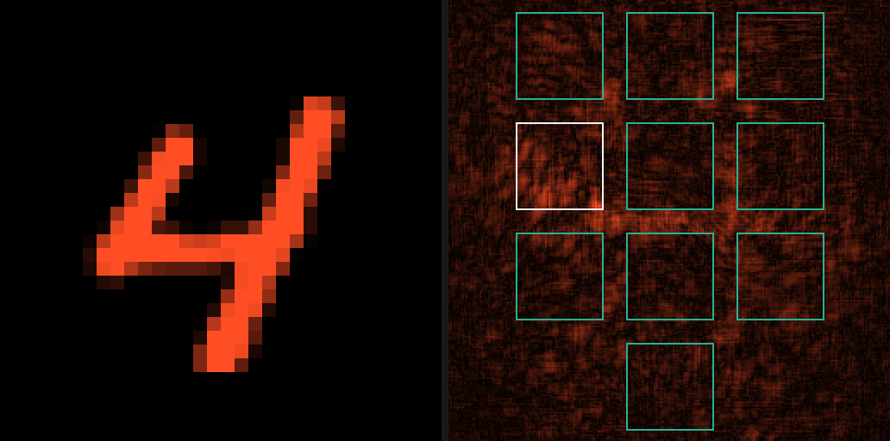
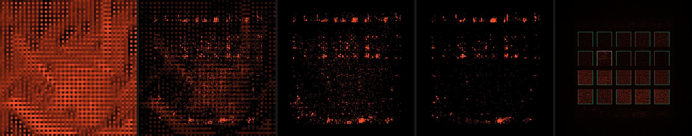
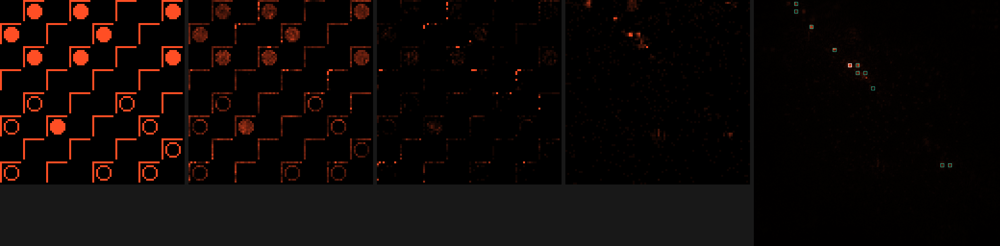
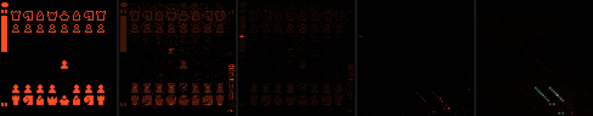
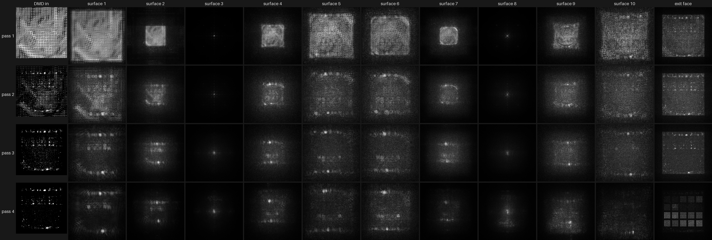
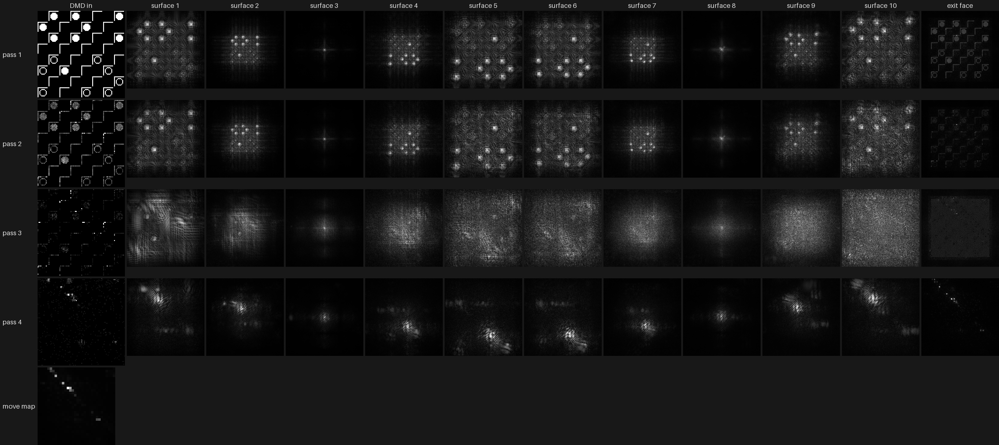
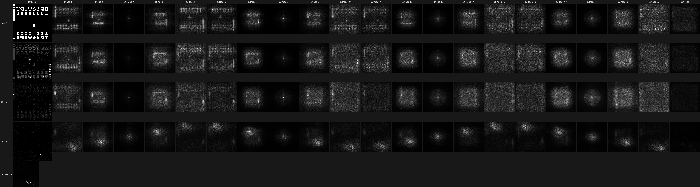

# neuralcrystal

Run a trained **NeuralCrystal** in PyTorch: a block of glass with stacked phase surfaces that answers a question with light.

A NeuralCrystal is a passive optical computer. A micromirror array (DMD) writes the input as a picture of light at 617 nm. The light diffracts through a stack of etched phase surfaces inside fused silica, and a camera reads the answer from where the light lands. The four-pass crystals (CIFAR-10, checkers and chess) send the light through four sections of the same block: between passes, the camera's picture is written back onto the DMD. This package simulates that light path exactly as the crystals were trained, so you can send in your own images and read the answers out.

[NeuralCrystal](https://neuralcrystal.com) was created by Pete DeLaurentis as a demo of [Shellcaster](https://shellcaster.com), an IDE for building complex projects with agents.

## Install

```
pip install neuralcrystal          # numpy + torch; Pillow for the examples
```

## The crystals

Each crystal comes as three files with the same contents at different precision. All three load the same way.

| File | What it holds |
|---|---|
| `<problem>-crystal.safetensors` | the phase surfaces in fp32 |
| `<problem>-crystal-16bit.safetensors` | the phase wrapped to one turn, 16 bits a sample, cropped to the lit window |
| `<problem>-crystal-8bit.safetensors` | the same at 8 bits |

```python
import neuralcrystal as nc
crystal = nc.load("cifar10-crystal-16bit.safetensors")     # runs on CUDA or Apple MPS when present, else the CPU
```

## MNIST: a digit in, the digit out

```python
import numpy as np
from PIL import Image
import neuralcrystal as nc
from neuralcrystal import mnist

crystal = nc.load("mnist-crystal.safetensors")
img = np.array(Image.open("examples/assets/digit-4.png").convert("L"))   # uint8 [28, 28], white ink on black
digit, scores = mnist.classify(crystal, img)                             # also takes a batch [B, 28, 28]
print(int(digit[0]))                                                     # 4
```

The digit is drawn on a 32 × 32 DMD frame and makes one pass through the crystal. Ten squares on the exit face collect the light, and the brightest square is the answer.

`python examples/mnist_example.py mnist-crystal.safetensors examples/assets/digit-4.png` prints the light on each square and draws the DMD frame going in (left) and the light on the exit face (right), with the ten squares outlined and the answer in orange:



## CIFAR-10: a photo in, a class out

```python
from neuralcrystal import cifar10

crystal = nc.load("cifar10-crystal.safetensors")
photo = np.array(Image.open("examples/assets/frog.png").convert("RGB"))  # uint8 [32, 32, 3]
cls, scores = cifar10.classify(crystal, photo)                            # one run
cls, scores = cifar10.classify(crystal, photo, flip=True)                 # + the mirrored photo: the "with flip" accuracy
print(cifar10.LABELS[int(cls[0])])                                        # frog
```

The photo is contrast-normalised and drawn on a 256 × 256 DMD frame. Every photo pixel becomes a 2 × 2 of colour regions (red, green, blue, and 255 − luma), each one area-dithered. The light makes four passes. Between passes, the camera's picture is exposed from its own mean and spread, then dithered back onto the DMD. Twenty squares in ten differential pairs read the answer: class *k* scores (p⁺ − p⁻) / (p⁺ + p⁻), and the largest wins.

`python examples/cifar10_example.py cifar10-crystal.safetensors examples/assets/frog.png` draws every picture the light makes: the DMD frame, the camera's picture after passes 1, 2 and 3 (what the DMD shows the next pass), and the exit face with the twenty squares, the answer's plus square in orange:



## Checkers: a position in, a move out

```python
from neuralcrystal import checkers as ck

crystal = nc.load("checkers-crystal.safetensors")
pos = ck.parse("bb.bb...b.wb.b.b....w.ww.w.ww.ww w - 0")   # 32 squares in draughts order, side to move, jumping piece, idle moves
move, scores = ck.best_move(crystal, pos)                    # the brightest legal move, and every legal move's light
print(ck.uci(move))                                          # e.g. 22-18 (a step) or 22x15 (a jump)
pos = ck.make(pos, move)                                     # if pos.jump >= 0 the same side must jump again: ask again
```

The position is drawn as a 96 × 96 picture from the side to move's point of view: your men are discs, your kings are discs with a crown, the other side's pieces are rings, and empty dark squares have a corner bracket. The light makes four passes. The exit face holds a 32 × 32 move map, where the row is the from-square and the column is the to-square. The package reads the light in every legal move's cell, and the brightest wins. `ck.moves`, `ck.make` and `ck.status` implement the full rules of American checkers: captures are compulsory, jump chains are played one jump at a time, and a man crowned on the far row ends its turn. Pass `temp` and `top_k` to `best_move` to sample among the brightest moves instead.

`python examples/checkers_example.py checkers-crystal.safetensors "<position>"` prints every legal move's light and draws the DMD frame, the camera's picture after passes 1, 2 and 3, and the exit face, with the legal moves' cells outlined in blue and the crystal's move in orange:



## Chess: a position in, a move out

```python
from neuralcrystal import chess as ch

crystal = nc.load("chess-crystal.safetensors")
pos = ch.parse("rnbqkbnr/pppppppp/8/8/4P3/8/PPPP1PPP/RNBQKBNR b KQkq e3 0 1")   # any FEN, either side to move
pick = ch.best_move(crystal, pos)                    # the brightest legal move
print(ch.san(pos, pick.move), pick.wdl)              # e5, and (win, draw, loss) for the side to move
pick = ch.best_move(crystal, pos, think=(3, 5))      # let it think two moves ahead
pos = ch.make(pos, pick.move)
```

The crystal's input is a picture of the board. `ch.best_move` draws it for you from the FEN, but you can make it yourself, save it, edit it, and pass it in:

```python
import numpy as np, torch
from PIL import Image

board = ch.frame(pos)                                         # the 192 × 192 board picture the crystal sees (0 = dark mirror, 1 = lit)
Image.fromarray((board * 255).astype(np.uint8)).save("board.png")

board = np.array(Image.open("board.png")) / 255.0             # any picture drawn in this style can go in
E, _ = crystal.run(torch.tensor(board, dtype=torch.float32)[None])
move_map = ch.move_map(crystal, E)[0]                         # 64 × 64 light: row = from-square, column = to-square
move, light = ch.move_scores(crystal, E, pos)[0]              # the brightest legal move (the position tells it which moves are legal)
print(ch.san(pos, move), ch.value(crystal, E)[0])            # e6, and (win, draw, loss)
```

The picture has to be in the crystal's own drawing style. It won't read a photo or a screenshot of an ordinary chessboard.

The crystal always sees the board from the side to move. White's positions are mirrored before they go in and the move is turned back afterwards, so you can ask about either side. The position is drawn as a 192 × 192 picture of the board. The light makes four passes and lands on a 64 × 64 move map (row = from-square, column = to-square) plus three cells that read win, draw and loss. The brightest legal cell is the move. `ch.moves`, `ch.make`, `ch.status` and `ch.san` implement the full rules: castling, en passant, promotion, check, mate, stalemate and the draw rules.

With `think=(3, 5)` the crystal looks ahead. It takes its three brightest moves, reads the board after each, takes the opponent's five brightest replies to each, and reads those boards' win/draw/loss. It then plays the move with the best expected score after those replies. That's 19 runs of the crystal instead of one, and it's how the published chess numbers were measured.

`python examples/chess_example.py chess-crystal.safetensors "<FEN>" [out.png] [--think]` prints the move, the five brightest moves and the win/draw/loss reading. It also draws the DMD frame, the camera's picture after passes 1, 2 and 3, and the move map, with the legal moves outlined in blue and the crystal's move in orange. After 1. e4 the crystal answers e6, the French Defence:



Looking ahead matters. In this endgame (`7k/1p5p/7P/2P5/p1B5/P3q3/K2R2P1/7R b - - 0 40`) the brightest move is Qe2, which walks the queen into the rook and bishop. Thinking two moves ahead sees that and plays Qf2 instead:

```
black to move: the crystal plays Qf2 (e3f2)
  Qe2     ########################################
  Qf2     ###############################
  thought about ['e3e2', 'e3f2', 'e3f4'], expected scores [0.03, 0.23, 0.13]
```

## Seeing inside: pictures at every stage

Every number above comes from light, and you can look at that light anywhere along the way. Each step below returns plain tensors. `neuralcrystal.pictures` turns them into images (`frame`, `light`, `exit_light`, `strip`, `grid`, `save`).

**The pictures going in.** `mnist.frame(img)`, `cifar10.frame(crystal, photo)` and `checkers.frames([pos])` return exactly what the micromirror array shows: float `[B, F, F]` in 0..1.

```python
from neuralcrystal import pictures
frames = cifar10.frame(crystal, photo)
pictures.save(pictures.frame(frames[0], scale=2), "dmd.png")
```

**The pictures between passes.** On the four-pass crystals, a camera reads the light after each pass and writes its picture back onto the mirrors for the next one. After any run they're in `crystal.hidden_pictures`.

```python
E, _ = crystal.run(frames)
for k, h in enumerate(crystal.hidden_pictures):                  # [B, F, F] each, as the DMD shows it
    pictures.save(pictures.frame(h[0], scale=2), f"after-pass-{k + 1}.png")
```

**The light at every surface.** `crystal.trace(frames)` runs the crystal and records the light arriving at each etched surface of each pass, and at each pass's exit face. It's the same computation as `run`, and recording changes nothing.

```python
E, steps = crystal.trace(frames, n=128)                          # steps: [{"pass", "plane", "kind", "light"}], light [B, n, n]
first_pass = [pictures.light(s["light"][0]) for s in steps if s["pass"] == 0]
pictures.save(pictures.strip(first_pass), "pass-1.png")
```

**The answer.** The exit field `E` is where every answer is read. `pictures.exit_light(crystal, E)` draws it with the classifiers' squares outlined. For checkers, `checkers.move_map(crystal, E)` returns the 32 × 32 move map as a picture (row = from-square, column = to-square). `crystal.imager(crystal.readout(E, F))` gives the exit face as an F × F camera picture.

```python
mm = ck.move_map(crystal, E)[0]                                  # [32, 32]: the light in every from → to cell
pictures.save(pictures.light(mm, scale=8), "move-map.png")
```

`python examples/inside_example.py <crystal> <image or position>` puts it all on one labelled sheet. How to read it:

- **Each row is one pass of the light through one section of the glass.** The four-pass crystals have four rows; MNIST has one.
- **The first column ("DMD in") is the picture the micromirror array launched for that pass.** On row 1 that's the input (the photo, the board). On later rows it's the camera's picture of the previous pass's exit face, as it was written back onto the mirrors.
- **The middle columns are the light arriving at each etched surface in turn** (ten per section here, twenty for chess), seen face-on across the lit window. That's what the light looks like inside the glass, just before each surface bends it.
- **The last column ("exit face") is the light leaving the section.** That's what the camera reads for the next pass, or, on the last row, where the answer is read.
- **"move map"** (checkers and chess): the last exit face read as the move grid, row = from-square, column = to-square.

Every tile is scaled to its own brightest point, with a square-root brightness so faint light shows, so compare shapes rather than brightness between tiles.

The CIFAR-10 frog: the photo goes in at top left, and the twenty readout squares light up at bottom right:



The checkers position from the example above. In the first two passes you can see the board itself being re-imaged at several surfaces, and squeezed to a small spot at surfaces 3 and 8. Passes 3 and 4 no longer look like the board: by then the light is computing the move. Moves only go to nearby squares, so the legal cells sit near the move map's diagonal, and that's where the light gathers:



And the chess crystal after 1. e4: four passes of twenty surfaces each, and the 64 × 64 move map:



## What the simulation is

Scalar, coherent light at one wavelength in fused silica (n = 1.4607). The light travels between surfaces by the band-limited angular spectrum method, and each surface multiplies the field by exp(iφ). The block's sides absorb light that reaches them. This is the same forward pass the crystals were trained with: on the same input, the fp32 files give the training code's output bit for bit.

## Licence

The code is MIT. The crystals are CC BY-NC 4.0. © 2026 TextJam, Inc.
